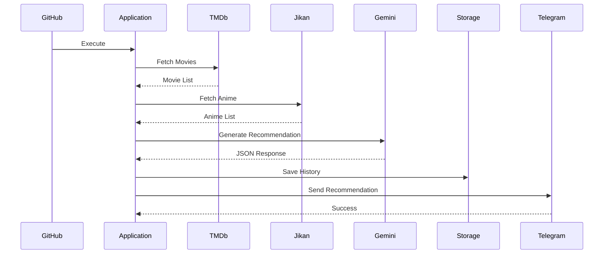

# CineOps AI

# Software Architecture Document (SAD)

Version: 1.0.0

Status: Approved

Author: Kevin J T

---

# 1. Purpose

This document defines the complete software architecture for CineOps AI.

It specifies the architectural style, module responsibilities, dependency rules, communication flow, design patterns, deployment strategy, scalability roadmap, and engineering standards.

This document is the authoritative implementation blueprint for all developers and AI coding agents.

---

# 2. Architecture Goals

The architecture shall provide:

- High maintainability
- High readability
- Easy testing
- High modularity
- Loose coupling
- High cohesion
- Extensibility
- Scalability
- Production readiness
- Cloud compatibility

---

# 3. Architectural Principles

The project shall follow:

- Clean Architecture
- SOLID Principles
- Separation of Concerns
- DRY
- KISS
- Fail Fast
- Dependency Inversion
- Single Responsibility Principle
- Explicit Configuration
- Composition over Inheritance

---

# 4. High-Level Architecture

```

```
                    +-------------------------+
                    | GitHub Actions Scheduler|
                    +------------+------------+
                                 |
                                 v
                     +----------------------+
                     | Application Layer    |
                     +----------+-----------+
                                |
        +-----------------------+------------------------+
        |                        |                       |
        v                        v                       v
+----------------+      +----------------+      +----------------+
| Discovery      |      | AI Engine      |      | Storage        |
| Services       |      | Services       |      | Services       |
+-------+--------+      +-------+--------+      +-------+--------+
        |                       |                       |
        v                       v                       v
 TMDb API              Gemini API              JSON Storage
 Jikan API                                     Cache
                                               History
                                               Blacklist

                                |
                                v
                     +----------------------+
                     | Notification Layer   |
                     +----------+-----------+
                                |
                                v
                         Telegram Bot API
```

---

# 5. Clean Architecture Layers

```

```
Presentation Layer

↓

Application Layer

↓

Domain Layer

↓

Infrastructure Layer
```

Dependencies always point inward.

Outer layers never contain business logic.

---

# 6. Folder Structure

```

```
cineops-ai/

docs/

.github/

config/

core/

domain/

services/

repositories/

storage/

output/

tests/

scripts/

assets/

logs/

README.md

LICENSE

requirements.txt

.env.example
```

---

# 7. Module Responsibilities

## config/

Responsible for:

- Loading .env
- Configuration validation
- Runtime configuration
- Environment detection

Contains:

```

```
settings.py

constants.py

environments.py
```

---

## core/

Contains shared logic.

Examples

```

```
logger.py

exceptions.py

retry.py

cache.py

utils.py

validators.py
```

---

## domain/

Contains business entities.

```

```
Recommendation

Movie

Anime

Series

Caption

Hashtag

ViralScore
```

Business rules belong here.

---

## services/

Contains integrations.

Examples

```

```
tmdb_service.py

anime_service.py

gemini_service.py

telegram_service.py

history_service.py

recommendation_service.py
```

---

## repositories/

Responsible for persistence.

```

```
HistoryRepository

CacheRepository

BlacklistRepository
```

No API calls here.

---

## storage/

Contains

```

```
history.json

cache.json

blacklist.json

config.json
```

---

## output/

Every execution stores

```

```
recommendation.json

recommendation.md

recommendation.txt

recommendation.csv
```

---

# 8. Domain Model

Recommendation

contains

Movie

Category

Genre

Rating

Popularity

Caption

Hook

Hashtags

Scene

Viral Score

Confidence

Publishing Time

Search Keywords

Reason

Clip Duration

Thumbnail Text

---

# 9. Dependency Rules

Allowed

```

```
Presentation

↓

Application

↓

Domain

↓

Infrastructure
```

Forbidden

Infrastructure

↓

Presentation

Repositories

↓

Services

Circular imports

---

# 10. Design Patterns

Repository Pattern

Factory Pattern

Strategy Pattern

Builder Pattern

Adapter Pattern

Dependency Injection

Facade Pattern

Singleton (Configuration only)

---

# 11. Request Lifecycle

```

```
GitHub Action

↓

Application Starts

↓

Load Configuration

↓

Validate Environment

↓

Load Cache

↓

Fetch Movies

↓

Fetch Series

↓

Fetch Anime

↓

Merge Data

↓

Remove Duplicates

↓

Apply Filters

↓

Calculate Metrics

↓

Generate AI Prompt

↓

Gemini Response

↓

Validate JSON

↓

Calculate Viral Score

↓

Store History

↓

Export Files

↓

Send Telegram

↓

Finish
```

---

# 12. Sequence Diagram



---

# 13. Configuration Management

Configuration sources

1 Environment Variables

2 JSON Config

3 Default Constants

Priority

Environment

↓

JSON

↓

Defaults

---

# 14. Error Handling

Every service shall

Raise typed exceptions

Retry network failures

Handle timeouts

Handle invalid JSON

Log errors

Continue execution whenever possible

Never terminate unexpectedly.

---

# 15. Logging Strategy

Use

Python logging

Levels

DEBUG

INFO

WARNING

ERROR

CRITICAL

Output

Console

Rotating Log File

Daily Logs

---

# 16. Retry Strategy

Use exponential backoff.

Retry

3 attempts

Delay

1 second

2 seconds

4 seconds

Maximum

5 retries

---

# 17. Cache Strategy

Cache

Trending Movies

Trending Series

Trending Anime

TTL

6 hours

If cache exists

Use cache.

Else

Call API.

---

# 18. Recommendation Engine

Steps

Collect Data

↓

Filter

↓

Remove Duplicates

↓

Popularity Ranking

↓

AI Selection

↓

AI Validation

↓

Viral Score

↓

Publish

---

# 19. AI Engine

Gemini responsibilities

Choose

1 Movie

1 Anime

1 TV Series

Generate

Scene

Caption

Hook

Hashtags

Posting Time

Audience

Reason

JSON Only

Never Markdown

---

# 20. Viral Scoring Engine

Factors

Popularity

30%

Rating

20%

Recognition

15%

Visual Impact

15%

Emotional Impact

10%

Social Potential

10%

Final Score

0–100

---

# 21. Security

Never store secrets.

Never log secrets.

Validate every response.

Escape Markdown.

Validate JSON.

Prevent malformed AI responses.

---

# 22. Performance Targets

Application startup

<2 seconds

Recommendation

<45 seconds

Telegram delivery

<3 seconds

Memory

<500MB

CPU

Optimized

---

# 23. Testing Strategy

Unit Tests

Integration Tests

Mock API Tests

JSON Validation Tests

History Tests

Retry Tests

Coverage Target

90%

---

# 24. GitHub Actions

Pipeline

Checkout

↓

Install Python

↓

Install Dependencies

↓

Run Ruff

↓

Run Black Check

↓

Run Pytest

↓

Run Application

↓

Upload Logs

↓

Store Artifacts

---

# 25. Future Expansion

Future modules

Dashboard

REST API

GraphQL

Web UI

Database

Redis

Celery

RabbitMQ

Authentication

Analytics

Instagram API

Multi User

Plugin System

AI Provider Abstraction

Docker Swarm

Kubernetes

---

# 26. Engineering Standards

Maximum file size

300 lines

Maximum function size

40 lines

Maximum class size

250 lines

Cyclomatic Complexity

Below 10

Use type hints.

Use docstrings.

No global mutable state.

No duplicated logic.

---

# 27. Code Review Checklist

Every Pull Request shall verify

✓ Tests pass

✓ Formatting passes

✓ Ruff passes

✓ No TODO comments

✓ No duplicate code

✓ Logging added

✓ Errors handled

✓ Documentation updated

✓ Type hints present

✓ Public functions documented

---

# 28. Acceptance Criteria

The architecture shall be considered complete when

All modules are implemented.

Dependencies follow Clean Architecture.

Tests pass.

Documentation is complete.

CI passes.

No architectural violations remain.

Repository is production-ready.

---

End of Document
